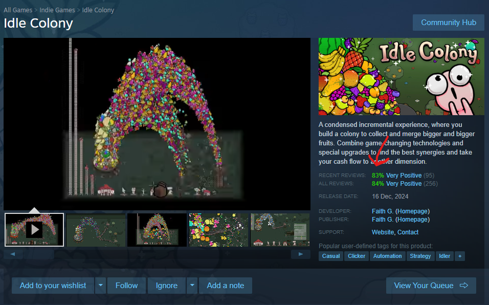

# Steam Review Percentage

A simple userscript that adds a review percentage to Steam's game pages.

## Features

- Displays a badge with the review percentage of a game. 😛

## Installation

1. Install a userscript manager, such as [Violentmonkey](https://violentmonkey.github.io/).
2. Click the button below to install the script:

## Showcase

## Usage

Once installed, visit any Steam game page, and you'll see the review percentage displayed on the page.

## License

This project is licensed under the MIT License - see the [LICENSE](LICENSE) file for details.

